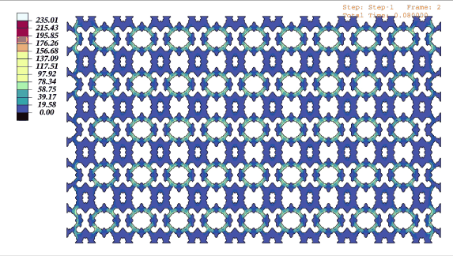

  
# Inverse Design of Energy-dissipating Walls Based on Self-Supervised Diffusion Models
  

 

<!-- 反向设计 -->
* ## **_SSIDM for energy-dissipating wall generation_**

  
  
  
   
<strong>Fig. 1. Results of the inverse design of energy-dissipating walls</strong>

     

* ## ⚛️ **_Datasets & Pre-trained models_**
  Due to the large size of the HPPN training set, which is *__10.2 GB__*, it can be obtained by contacting the corresponding author if necessary. The HPPN test set and the DiffEDW training set can be accessed via the link below.

      
[**🔗The EDW dataset**](https://github.com/AshenOneme/SSIDM/releases/tag/EDW_Dataset)     
[**🔗The weights of the HPPN & DiffEDW**](https://github.com/AshenOneme/SSIDM/releases/tag/Pretrained_weights)

  
## 🌟🌟🌟🌟🌟🌟🌟🌟🌟🌟🌟🌟🌟🌟🌟🌟🌟🌟🌟🌟
  

 

___

> *__This research introduces a novel framework for designing energy-dissipating walls by utilizing an inverse design method based on self-supervised diffusion models. SSIDM is established by integrating a generator (DiffEDW) and a discriminator (HPPN), which can generate EDW structures that meet the specified mechanical property targets based on the seismic performance demands of the structure.__*

<!-- 流程图 -->
* ## **_Workflow_**

In this work, a novel energy-dissipating system integrating non-structural infill walls and energy-dissipating walls (EDWs) is proposed to improve the seismic performance of frame-infill wall structures. Based on the diffusion model, a self-supervised inverse design model (SSIDM) is developed to enhance the design accuracy of complex EDWs.

  
  
<strong>Fig. 2. The proposed workflow for SSIDM</strong>

 

<!-- 数据集 -->
* ## **_Dataset_**

A total of *__12,800__* EDWs with dimensions of *__240 × 480__* and different structures were subjected to low-cycle hysteresis loading, resulting in the corresponding hysteresis curves.

  
  
<strong>Fig. 3. Low-cycle cyclic hysteresis loading</strong>

 

<!-- HPPN信息 -->
* ## **_Discriminator parameters and test error_**
8 neural network models were employed to construct the generator, with *__ResNet18__* ultimately selected as the HPPN. The parameter information and errors for each model are presented in the table.

| Model | Params | Memory (MB) | Madd (G) | Flops (G) | MemR+W (MB) | RMSE (kN) |
| :-----: | :-----: | :-----: | :-----: | :-----: | :-----: | :-----: |
| VGG16 | 138,421,457 | 250.89 | 70.49 | 35.3 | 1034.24 | 3.37 |
| **ResNet18** | **11,318,337** | **52.45** | **8.12** | **4.06** | **149.79** | **4.06** |
| ResNet50 | 23,634,945 | 252.61 |18.72	| 9.38	|595.69 |	4.07 |
| ResNet101 |	42,627,073 | 372.14 |35.81 | 17.93	|907.20 |4.74 |
| Inception v4 | 321,473 | 139.25 |16.52 | 8.26 |342.84 | 14.56 |
| ResNeXt50 |	23,106,817 | 310.32 |19.38 | 9.71 |709.10 | 4.38 |
| SwinT |	48,836,513 | 376.99 |486.67 |	246.27 |1331.20	| 18.06 |
| ViT |	85,260,353 | 554.78 |208.98 |	104.95	|651.79 | 12.51 |

<!-- 生成过程 -->
* ## **_Generation process_**

The generation process of the EDWs under three different mechanical property targets are illustrated in Fig. 4. The red lines represent the mechanical property requirements, while the blue lines indicate the FEA results of the intermediate products during the EDW generation process. The *__ABAQUS__* calculation files (*__1~100.inp__*) for the corresponding EDWs in the figure are located in folder [**🔗SSIDM_generation_process**](https://github.com/AshenOneme/SSIDM/tree/main/SSIDM_generation_process).

  
  
<strong>Fig. 4. The generation process of SSIDM</strong>

 
