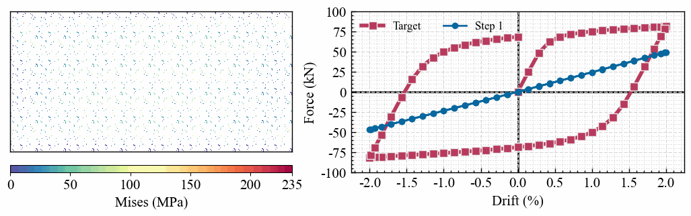
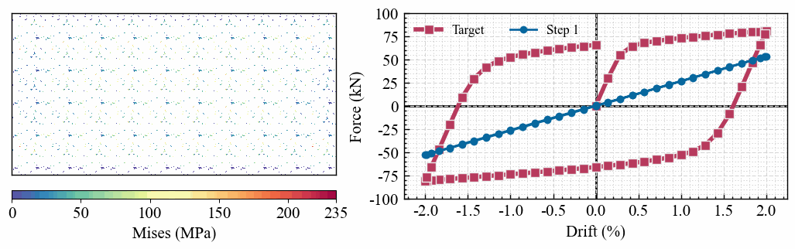
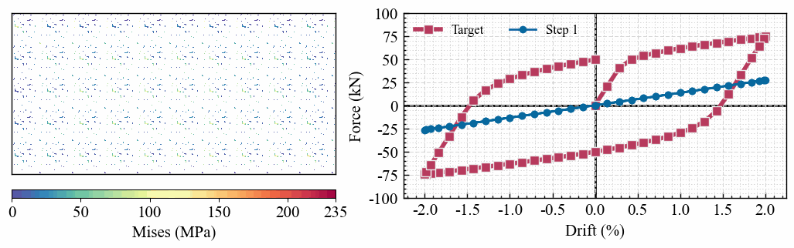
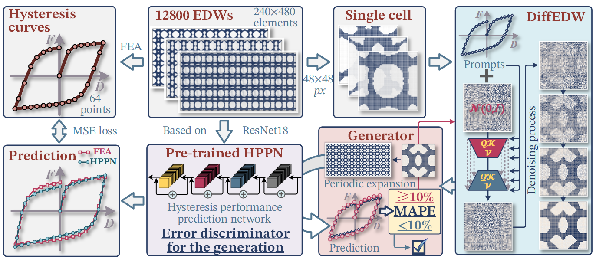

  
# Inverse Design of Energy-dissipating Walls Based on Self-Supervised Diffusion Models
  

 

<!-- 反向设计 -->
* ## **_SSIDM for energy-dissipating wall generation_**

  
  
  
   
<strong>Results of the inverse design of energy-dissipating walls</strong>

     

* ## ⚛️ **_Datasets & Pre-trained models_**
  __Due to the large size of the HPPN training set, which is 10.2 GB, it can be obtained by contacting the corresponding author if necessary. The HPPN test set and the DiffEDW training set can be accessed via the link below.__

      
[**🔗The EDW dataset**](https://github.com/AshenOneme/SSIDM/releases/tag/EDW_Dataset)     
[**🔗The weights of the HPPN & DiffEDW**](https://github.com/AshenOneme/SSIDM/releases/tag/Pretrained_weights)

  
## 🌟🌟🌟🌟🌟🌟🌟🌟🌟🌟🌟🌟🌟🌟🌟🌟🌟🌟🌟🌟
  

 

___

*__The research introduces a novel framework for designing energy-dissipating walls by utilizing an inverse design method based on self-supervised diffusion models. SSIDM is established by integrating a generator (DiffEDW) and a discriminator (HPPN), which can generate EDW structures that meet the specified mechanical property targets based on the seismic performance demands of the structure.__*

<!-- 流程图 -->
* ## **_Workflow_**

In this work, a novel energy-dissipating system integrating non-structural infill walls and energy-dissipating walls (EDWs) is proposed to improve the seismic performance of frame-infill wall structures. Based on the diffusion model, a self-supervised inverse design model (SSIDM) is developed to enhance the design accuracy of complex EDWs.

  
  
<strong>Fig.1 The proposed workflow for SSIDM</strong>

 
